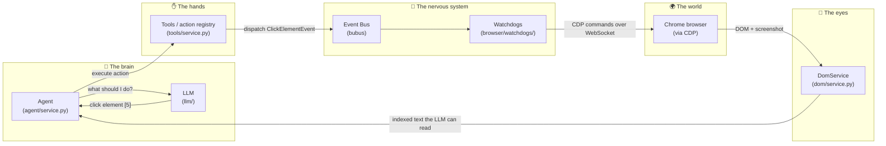

# 00 — Start Here: What is browser-use?

**browser-use** is a Python library that lets an AI model drive a real Chrome browser. You give it a task in plain English — *"Find the number of GitHub stars of these 5 repos"* — and it opens a browser, looks at the page, decides what to click or type, does it, looks again, and repeats until the task is done.

That's the whole idea. Everything in this codebase exists to support one loop:

> **look at the page → ask the LLM what to do → do it → repeat**

This guide walks you through how that loop is built, one layer at a time, assuming you know basic Python but nothing about browser automation or LLM tooling.

---

## The 30-second mental model



Five roles, five packages:

| Role | Package | What it does |
|---|---|---|
| **Brain** | `browser_use/agent/` | Runs the loop, builds the prompt, calls the LLM, keeps history |
| **Eyes** | `browser_use/dom/` | Turns a messy live webpage into a short, numbered list of elements the LLM can read |
| **Hands** | `browser_use/tools/` | A registry of actions (`click`, `input`, `scroll`, …) the LLM is allowed to pick from |
| **Nervous system** | `browser_use/browser/` | `BrowserSession` + an event bus + "watchdog" services that actually talk to Chrome |
| **Mouth/ears** | `browser_use/llm/` | Talks to OpenAI / Anthropic / Google / etc. behind one common interface |

Keep this picture in your head — every chapter of this guide zooms into one box.

---

## Run it once before reading further

Seriously — watching it run makes everything below click. Setup (from the repo root):

```bash
uv venv --python 3.11
source .venv/bin/activate
uv sync
```

The simplest possible script is [examples/simple.py](../../examples/simple.py):

```python
from dotenv import load_dotenv

from browser_use import Agent, ChatBrowserUse

load_dotenv()

agent = Agent(
	task='Find the number of stars of the following repos: browser-use, playwright, stagehand, react, nextjs',
	llm=ChatBrowserUse(model='bu-2-0-mini-preview'),
)
agent.run_sync()
```

(You'll need an API key: get one at https://cloud.browser-use.com/new-api-key and `export BROWSER_USE_API_KEY="your-key"`, or use any other provider — see chapter 06.)

The async version — which is how the library is really meant to be used, since everything inside is `async` — is [examples/getting_started/01_basic_search.py](../../examples/getting_started/01_basic_search.py):

```python
import asyncio

from browser_use import Agent, ChatBrowserUse


async def main():
	llm = ChatBrowserUse(model='bu-2-0-mini-preview')
	task = "Search Google for 'what is browser automation' and tell me the top 3 results"
	agent = Agent(task=task, llm=llm)
	await agent.run()


asyncio.run(main())
```

Tip: pass `Agent(..., browser_profile=BrowserProfile(headless=False))` to watch the browser do its thing in a visible window.

---

## Glossary — the words this codebase uses constantly

Read these now; every later chapter assumes them.

**LLM (Large Language Model)** — the AI model (GPT, Claude, Gemini, …) that makes decisions. In this codebase it's always behind the `BaseChatModel` interface (chapter 06). The LLM never touches the browser; it only reads text/screenshots and returns JSON.

**CDP (Chrome DevTools Protocol)** — the remote-control API built into Chrome. When you press F12 and use DevTools, DevTools itself talks to Chrome over CDP. browser-use opens the same WebSocket connection and sends the same kinds of commands (`Page.navigate`, `Input.dispatchMouseEvent`, …). The typed Python wrapper used here is [`cdp-use`](https://github.com/browser-use/cdp-use); you'll see calls like `cdp_client.send.Page.navigate(...)` everywhere.

**Event bus** — a message board for code. Instead of module A directly calling a function in module B, A posts ("dispatches") an *event* object, and whoever subscribed to that event type handles it. The library used is [`bubus`](https://github.com/browser-use/bubus). Why bother? It decouples the modules: the tools layer doesn't need to know *how* a click happens, it just posts `ClickElementEvent` and awaits the result. Chapter 03 covers this in depth.

**Watchdog** — browser-use's name for a small service that subscribes to events on the bus and owns exactly one concern: one watchdog executes clicks, one builds DOM snapshots, one handles downloads, one auto-dismisses popups, etc. There are 14 of them.

**Pydantic model** — a Python class (from the [pydantic](https://docs.pydantic.dev/) library) that declares typed fields and validates data at runtime. This codebase uses them for *everything* structured: settings, action parameters, LLM output, results. If you see `class Foo(BaseModel):`, it's pydantic. Convention: they live in `views.py` files.

**Structured output** — forcing the LLM to reply with JSON that matches a specific schema (a pydantic model), instead of free-form prose. This is how the agent guarantees the LLM's answer is machine-readable: "you *must* return `{thinking, next_goal, action: [...]}`".

**Element index / selector map** — the LLM can't read a modern page's raw HTML (hundreds of KB of noise). So browser-use compresses the page into a numbered list like `[5]<button>Sign in />`, and keeps a `selector_map: dict[int, node]` on the side. The LLM just says "click 5"; the map resolves 5 back to the real element. Chapter 04 is entirely about this.

**Accessibility tree (AX tree)** — a parallel tree Chrome maintains for screen readers, where each element has a *role* ("button", "textbox") and a *name* ("Sign in"). browser-use merges it with the DOM tree because it's often a cleaner description of what an element *is* than the HTML.

**`async` / `await`** — everything in this library is asynchronous Python (`asyncio`): functions declared `async def` return immediately with a *coroutine* that runs when awaited, letting one thread juggle many I/O operations (WebSocket messages, LLM HTTP calls) concurrently. You don't need deep asyncio knowledge to read the code — just know that `await foo()` means "run this and wait for the result without blocking everything else".

**Target / session (CDP jargon)** — a *target* is one browsing context: a tab, an iframe, or a worker. A *CDP session* is an open channel to one target — think of a target as a phone number and a session as an active call. Nearly every CDP command needs a `session_id` saying which call to speak into.

---

## How to read this guide

| Chapter | Question it answers |
|---|---|
| [01 — Project tour](01-project-tour.md) | Where is everything? What's the file layout convention? |
| [02 — The agent loop](02-the-agent-loop.md) | What actually happens inside `agent.run()`? |
| [03 — BrowserSession & events](03-browser-session-and-events.md) | How does code talk to Chrome? What's a watchdog? |
| [04 — DOM to text](04-dom-to-text.md) | How does the LLM "see" a webpage? Where does `[5]` come from? |
| [05 — Tools & actions](05-tools-and-actions.md) | What can the LLM do, and how do I add my own action? |
| [06 — The LLM layer](06-llm-layer.md) | How are 16 providers hidden behind one interface? |
| [07 — Follow a click](07-follow-a-click.md) | Capstone: trace `click(index=5)` through every layer. |

Read them in order — each chapter only uses terms defined earlier.

When you're comfortable with all of this, the repo also has [`kt/`](../../kt/00-INDEX.md) — denser architecture notes written for experienced engineers — and ~100 runnable scripts in [`examples/`](../../examples/) organized by topic. Those are your next stops.
