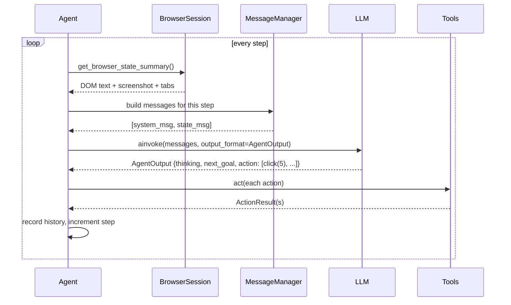
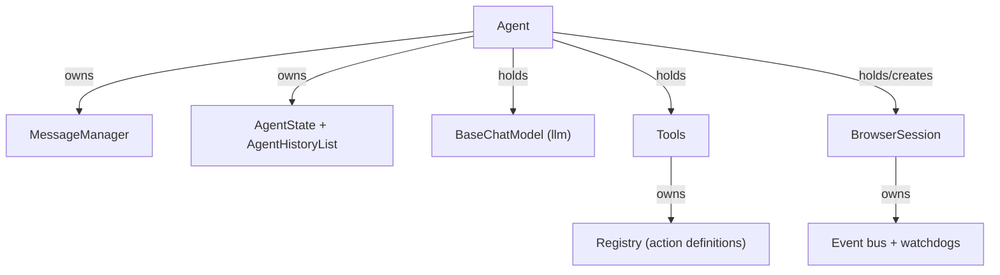

# 02 — The Agent Loop: How the Brain Works

Package: [browser_use/agent/](../../browser_use/agent/) · Main file: [agent/service.py](../../browser_use/agent/service.py)

When you call `agent.run()`, the agent repeats one cycle until the LLM says "done" (or it runs out of steps):



`agent/service.py` is 4100+ lines, but you only need to know ~10 methods. Here's the map.

## The outer loop — `run()`

[`Agent.run()`](../../browser_use/agent/service.py#L2506) does setup, then loops:

1. Installs a Ctrl+C handler (press once to pause, twice to quit).
2. Starts the browser: `await self.browser_session.start()` ([service.py:2566](../../browser_use/agent/service.py#L2566)).
3. **The loop** — [service.py:2603](../../browser_use/agent/service.py#L2603):
   ```python
   while self.state.n_steps <= max_steps:
       ...
       await self._execute_step(step_info)  # one full think-act cycle
   ```
   It breaks early when the LLM calls the `done` action, when `max_failures` consecutive steps error out, or when someone called `agent.stop()`.
4. On the way out (`finally`): logs token usage, optionally renders a GIF of the run, closes the browser, and returns `self.history` — an `AgentHistoryList`.

`_execute_step()` ([service.py:2441](../../browser_use/agent/service.py#L2441)) is a thin wrapper that applies a per-step timeout and checks "are we done?" afterward. The real work is in `step()`.

## One step — `step()` and its five phases

[`step()`](../../browser_use/agent/service.py#L1029) is deliberately tiny — it just calls five phase methods in order. This is the most important code path in the library:

| Phase | Method | What happens |
|---|---|---|
| 1. Look | [`_prepare_context()`](../../browser_use/agent/service.py#L1081) | Asks the `BrowserSession` for a fresh `BrowserStateSummary` (DOM text, screenshot, open tabs — chapter 04 explains how that's made). Rebuilds the list of available actions for the current page, then has the `MessageManager` assemble the LLM messages. Also injects "nudges" when needed: budget warnings, loop-detection warnings, a force-done message on the last step. |
| 2. Think | [`_get_next_action()`](../../browser_use/agent/service.py#L1170) | Sends the messages to the LLM with `output_format=AgentOutput` (structured output — the LLM *must* return that schema). Retries on rate limits, can switch to a fallback LLM, and if the model returns zero actions, re-asks once then injects `done(success=False)`. |
| 3. Act | [`_execute_actions()`](../../browser_use/agent/service.py#L1205) | One real line: `await self.multi_act(self.state.last_model_output.action)`. |
| 4. Digest | [`_post_process()`](../../browser_use/agent/service.py#L1213) | Checks for new downloads, updates the plan, feeds the loop detector, counts consecutive failures. |
| 5. Record | [`_finalize()`](../../browser_use/agent/service.py#L1350) | Builds an `AgentHistory` entry (screenshot, actions taken, results, timings), appends it to `agent.history`, and increments `state.n_steps`. |

Errors in any phase are caught by `_handle_step_error()` and become an `ActionResult(error=...)` — the *next* step's prompt will contain the error text so the LLM can react to it. Failure is data, not a crash.

## Executing actions — `multi_act()`

The LLM may return several actions in one step (e.g. type into a field, then click submit). [`multi_act()`](../../browser_use/agent/service.py#L2733) runs them in order via `self.tools.act(...)` (chapter 05), with two safety guards that beginners should know about:

- If an action **navigates or changes the page**, the remaining queued actions are abandoned ([service.py:2818-2831](../../browser_use/agent/service.py#L2818)). Why: those actions were chosen while looking at the *old* page; their element indices may now point at different elements. The comparison is done by URL + focused-tab checks, plus a static `terminates_sequence` flag on actions that always navigate.
- `done` is only honored as a **single** action, never mixed into a batch.

## The prompt — what the LLM actually reads

Two parts:

**The system message** — a static markdown file, chosen from 8 variants in [agent/system_prompts/](../../browser_use/agent/system_prompts/) by [`SystemPrompt`](../../browser_use/agent/prompts.py#L28) (default: [system_prompt.md](../../browser_use/agent/system_prompts/system_prompt.md), ~270 lines). Read it once — it's the "job description" the LLM operates under, and it explains many agent behaviors you'll observe.

**The state message** — rebuilt from scratch every step by [`AgentMessagePrompt`](../../browser_use/agent/prompts.py#L104). It's one big string of XML-tagged sections:

```
<user_request>       the task you gave it
<agent_history>      what happened in previous steps (as text!)
<agent_state>        current plan / todo items, files, budget
<browser_state>      tabs + the indexed DOM text from chapter 04
<read_state>         one-time content from extract/read_file actions
+ step counter, date, and (if vision is on) the screenshot(s)
```

### The key insight: it's not a chat log

A naive agent would append every LLM exchange to an ever-growing conversation. browser-use doesn't. Look at [`MessageHistory.get_messages()`](../../browser_use/agent/message_manager/views.py#L74): the LLM receives exactly **one system message + one state message** each step. Previous steps survive only as compact text lines inside `<agent_history>` (and can be further compressed by LLM summarization when they get long — "compaction").

Why this design? Token cost and focus. A 50-step run would otherwise carry 50 screenshots and 50 full DOM dumps in context. Instead the prompt stays roughly constant-size, with per-step-varying content placed at the *end* so providers can cache the stable prefix.

The class that manages all this is [`MessageManager`](../../browser_use/agent/message_manager/service.py#L104).

## The data shapes — `agent/views.py`

Five pydantic models carry everything; all in [agent/views.py](../../browser_use/agent/views.py):

| Model | Line | What it is |
|---|---|---|
| [`AgentOutput`](../../browser_use/agent/views.py#L388) | 388 | **What the LLM must return each step**: `thinking`, `evaluation_previous_goal`, `memory`, `next_goal`, and `action: list[ActionModel]`. The `action` list's schema is generated from the tools registry (chapter 05), so "what the LLM can do" and "what the LLM may say" are always in sync. |
| [`ActionResult`](../../browser_use/agent/views.py#L307) | 307 | The result of **one** action: `extracted_content` (feedback text), `error`, `is_done`/`success`, `long_term_memory` (a short line that stays in `<agent_history>` forever), `attachments`. |
| [`AgentState`](../../browser_use/agent/views.py#L251) | 251 | The mutable runtime state: step counter, consecutive failures, last output/result, paused/stopped flags. Serializable — pass it back in as `injected_agent_state` to resume a run. |
| [`AgentHistory`](../../browser_use/agent/views.py#L488) | 488 | One step's permanent record: model output + results + screenshot path + timings. |
| [`AgentHistoryList`](../../browser_use/agent/views.py#L595) | 595 | What `run()` returns — a list of `AgentHistory` with friendly accessors: `.final_result()`, `.is_done()`, `.is_successful()`, `.errors()`, `.urls()`, `.save_to_file()`. |

## Safety rails to know about

- **`max_steps`** (default 500) and **`max_failures`** (consecutive errors) bound the loop.
- **Timeouts** at every level: per-step (`step_timeout`), per-LLM-call (`llm_timeout`), per-action (chapter 05).
- **Loop detector** ([`ActionLoopDetector`](../../browser_use/agent/views.py#L157)): hashes recent actions + pages; if the agent is going in circles it injects a "you seem stuck, try something different" nudge into the prompt.
- **Fallback LLMs**: on provider errors/rate limits the agent can switch to `llm_fallbacks`.

## Who owns what



Note the direction of the arrows: **the Agent is the only orchestrator**. `Tools` knows nothing about the Agent or the LLM — everything it needs is passed per call. `BrowserSession` knows nothing about the Agent either. That's why you can use `BrowserSession` or `Tools` standalone, without an LLM in sight.

**Next:** [03 — BrowserSession & events](03-browser-session-and-events.md) — the layer the agent has been politely asking for browser state.
