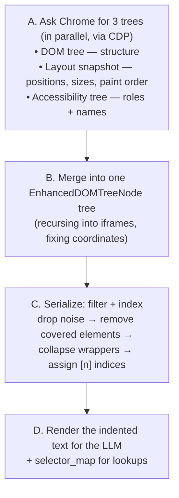

# 04 — DOM to Text: How the LLM "Sees" a Page

Package: [browser_use/dom/](../../browser_use/dom/) · Main files: [dom/service.py](../../browser_use/dom/service.py), [dom/serializer/serializer.py](../../browser_use/dom/serializer/serializer.py)

## The problem

An LLM can't usefully read a modern webpage's raw HTML. A typical page is hundreds of kilobytes of divs, scripts, and framework noise — mostly invisible, mostly non-interactive, and far beyond a sane token budget. And even if the LLM could read it, it would have no reliable way to *point* at an element ("click the third div inside the second section…" is fragile).

browser-use's answer: compress the page into a short, indented, **numbered** list of the elements that matter, and keep a lookup table on the side. The LLM reads something like:

```
[3]<input type=text placeholder=Search />
[5]<button type=submit>Sign in />
*[6]<a href=/help>Help />
|SHADOW(open)|[7]<input type=text />
```

- `[5]` — an **element index**. The LLM says `click(index=5)`; the `selector_map: dict[int, EnhancedDOMTreeNode]` resolves 5 back to the real element.
- `*` — this element is **new** since the previous step (helps the LLM notice what changed).
- Indentation mirrors the page structure; scroll containers, iframes, and shadow roots get markers.

The whole `dom/` package exists to produce that text and that map. Here's the pipeline.

## The pipeline



### A. Pull three trees — [`_get_all_trees()`](../../browser_use/dom/service.py#L403)

One page, three parallel CDP calls, three complementary views:

| CDP domain | Gives you |
|---|---|
| `DOM.getDocument` | The node tree — tags, attributes, parent/child structure |
| `DOMSnapshot.captureSnapshot` | Layout facts — where each element is painted, its size, computed styles, *paint order* (what's drawn on top of what), and whether it's clickable |
| `Accessibility.getFullAXTree` | The screen-reader view — each element's *role* ("button") and *name* ("Sign in"), which is often a cleaner semantic description than the HTML |

Plus the set of nodes that have JavaScript click listeners attached — an element with a click handler is interactive even if it's just a `<div>`.

### B. Merge — [`get_dom_tree()`](../../browser_use/dom/service.py#L703)

The three trees are keyed by the same `backendNodeId`, so they can be zipped together into one [`EnhancedDOMTreeNode`](../../browser_use/dom/views.py) per element: DOM info + AX info + layout info in a single object.

Iframes are handled here too: same-origin frames are walked inline, cross-origin frames require attaching to their separate CDP target (remember: an iframe is its own *target*). While recursing, each frame's coordinate offset is accumulated so that every node ends up with an `absolute_position` in page coordinates — an element 10px from its iframe's top-left is really at (iframe position + 10px) on the page. Visibility is computed by walking up through every ancestor frame's clipping.

### C. Serialize + index — [`DOMTreeSerializer`](../../browser_use/dom/serializer/serializer.py#L110)

`serialize_accessible_elements()` runs a sequence of passes over the merged tree:

1. **Simplify** — drop invisible/irrelevant nodes; detect interactive ones ([clickable_elements.py](../../browser_use/dom/serializer/clickable_elements.py)).
2. **Paint-order filtering** ([paint_order.py](../../browser_use/dom/serializer/paint_order.py)) — remove elements that are painted *underneath* other elements. If you couldn't physically click it, the LLM shouldn't see it.
3. **Optimize** — collapse pointless wrapper elements (`<div><div><div>…`).
4. **Bounding-box filtering** — drop children fully contained inside an interactive parent (the link's inner `<span>` doesn't need its own index).
5. **Assign indices** — [`_assign_interactive_indices_and_mark_new_nodes()`](../../browser_use/dom/serializer/serializer.py#L656): every visible interactive (or scrollable) node gets a `selector_index` and an entry in the `selector_map`. A nice detail: the index *is* the element's stable Chrome-internal `backend_node_id` where possible, so the same button keeps the same number across steps. Nodes that weren't in the previous step's map get `is_new=True` (the `*` marker).

### D. Render — `llm_representation()`

[`SerializedDOMState`](../../browser_use/dom/views.py#L932) holds the result: the simplified tree plus the `selector_map`. Its `llm_representation()` renders the indented pseudo-HTML shown above, with attributes filtered down to a useful whitelist (`type`, `placeholder`, `href`, `aria-label`, …). This string goes into the `<browser_state>` section of the prompt (chapter 02).

## Who calls this, and when

The agent never calls `DomService` directly. Each step, `_prepare_context()` calls `browser_session.get_browser_state_summary()`, which dispatches `BrowserStateRequestEvent` on the bus (chapter 03). The handler is [`DOMWatchdog.on_BrowserStateRequestEvent()`](../../browser_use/browser/watchdogs/dom_watchdog.py#L244), which:

1. Waits briefly for the network/page to settle.
2. Runs the pipeline above to build the DOM state.
3. Takes a **clean** screenshot (no highlight boxes drawn — the LLM sees the page as a user would; the numbered colored highlight boxes you see in a headful browser are injected separately, purely for the human watching).
4. Collects tab list, scroll position, pagination hints.
5. Returns a `BrowserStateSummary` and caches the `selector_map` on the session.

Later, when the LLM says `click(index=5)`, [`get_element_by_index()`](../../browser_use/browser/session.py#L2480) reads that cached map. If the page changed since the map was built, the lookup can miss — that's why the agent abandons queued actions after navigation (chapter 02), and why a timed-out state request returns a *deliberately empty* DOM rather than a stale one: better for the LLM to see "nothing" than to click ghosts.

## The failure mode to understand

Once you get this pipeline, most confusing agent behavior becomes explainable:

- **"Element index N not found"** → the map was rebuilt and the element is gone/renumbered; the LLM was acting on stale state.
- **The agent can't see an element you can see** → it was filtered: not detected as interactive, painted under something else, or outside the viewport/visibility rules.
- **The agent clicks the "wrong" thing** → look at what the *serialized text* said, not the pixels; the LLM only knows the text + screenshot.

To debug what the LLM sees, `browser_use/dom/playground/` has manual experimentation scripts, and `agent.history` stores each step's state.

**Next:** [05 — Tools & actions](05-tools-and-actions.md) — the registry of things the LLM can *do* with those indices.
